I'm a self-learning front-end developer with a passion for web programming. My goal is to develop scalable, maintainable and user-friendly web applications that provide a seamless user experience.

##
 

<!--- Web illustrations by Storyset ( https://storyset.com/web ) --->

 

- 🔭 I’m currently working on becoming a **Front-end Developer**

- 🌱 I’m currently learning **React**

- 👯 I’m looking to collaborate on developing new open-source projects

- 💬 Ask me about **HTML, CSS and JavaScript**

- 📫 How to reach me: **olorunnisolaibrahim46@gmail.com**

- 😄 Pronouns: HE/HIM

- ⚡ Fun fact: I love anime and video games. Oh, and cats too 😻!

   

## 🏆 **GOALS**

- 🚀 Gain experience in developing full-stack applications using **React and Node.js**
  
- 🏗 Build real world appplications

- 🎨 Master Advanced React Features: Learn Hooks, Context API, React Router, and React Query for state and data management.

- ⚛️ Explore Next.js or Remix: Build server-side rendered (SSR) and static sites for better performance and SEO.

- 📱 Responsive Design and Mobile-First Development: Use frameworks like Tailwind CSS, Bootstrap, or Material-UI.

- 💡 Learn Component Testing Tools: Use Jest and React Testing Library to write unit and integration tests.

- 🖥️ Optimize Performance: Learn techniques like lazy loading, code splitting, and image optimization.

 

<h3 align="center">🛠 Languages and Tools</h3>

  
  
  
  
  
  

😊😊😊

