I'm a self-learning front-enddeveloper with a passion for web programming. My goal is to develop scalable, maintainable and user-friendly web applications that provide a seamless user experience.

##
 

<!--- Web illustrations by Storyset ( https://storyset.com/web ) --->

 

- 🔭 I’m currently working on becoming a **Front-end Developer**

- 🌱 I’m currently learning Javascript

- 👯 I’m looking to collaborate on any open source project with javascript as it's main language

- 🤔 I’m looking for help with understanding **Asynchronous and Await functions in JavaScript**

- 💬 Ask me about **HTML, CSS and JavaScript**

- 📫 How to reach me: **olorunnisolaibrahim46@gmail.com**

- 😄 Pronouns: HE/HIM

- ⚡ Fun fact: I love anime and video games. Oh, and cats too 😻!

