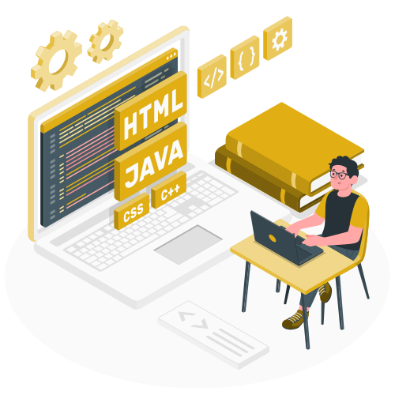

<h1 align="center">Hi 👋, I'm Ibrahim Hassan</h1>

A self-taught Front-End Developer passionate about building scalable and user-friendly web applications.

I enjoy turning ideas into real products using modern JavaScript tools and frameworks.

---

## 🚀 About Me

- 🔭 Currently building **React-based web applications**
- 🌱 Learning **advanced JavaScript, TypeScript and React architecture**
- ⚙️ Working with **Firebase (Auth, Firestore, Hosting)**
- 📊 Exploring **data visualization with Recharts**
- 👯 Open to collaborating on **JavaScript / React projects**
- 💬 Ask me about **HTML, CSS, JavaScript, React and Firebase**
- 📫 Reach me at **olorunnisolaibrahim46@gmail.com**

---

## 🧰 Tech Stack

### Frontend

### Backend / Services

### Tools

---

## 🧩 Featured Project

### 📚 Teacher Reporting System

A web application designed for schools where teachers submit daily reports and administrators review performance.

**Key Features**

- Teacher dashboards
- Daily report submission forms
- Admin analytics dashboard
- Firebase authentication system
- Firestore data management

**Tech Used**

React • Firebase • Tailwind CSS • Vite

---

## 📊 GitHub Stats

I'm a self-learning front-enddeveloper with a passion for web programming. My goal is to develop scalable, maintainable and user-friendly web applications that provide a seamless user experience.

##
 

<!--- Web illustrations by Storyset ( https://storyset.com/web ) --->

 

- 🔭 I’m currently working on becoming a **Front-end Developer**

- 🌱 I’m currently learning Javascript

- 👯 I’m looking to collaborate on any open source project with javascript as it's main language

- 🤔 I’m looking for help with understanding **Asynchronous and Await functions in JavaScript**

- 💬 Ask me about **HTML, CSS and JavaScript**

- 📫 How to reach me: **olorunnisolaibrahim46@gmail.com**

- 😄 Pronouns: HE/HIM

- ⚡ Fun fact: I love anime and video games. Oh, and cats too 😻!

